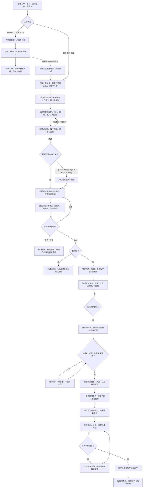
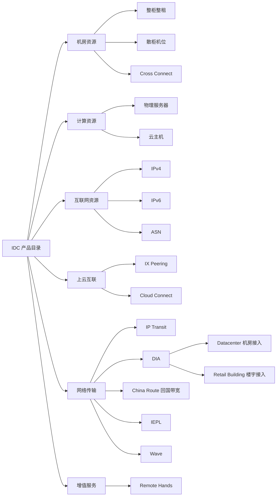
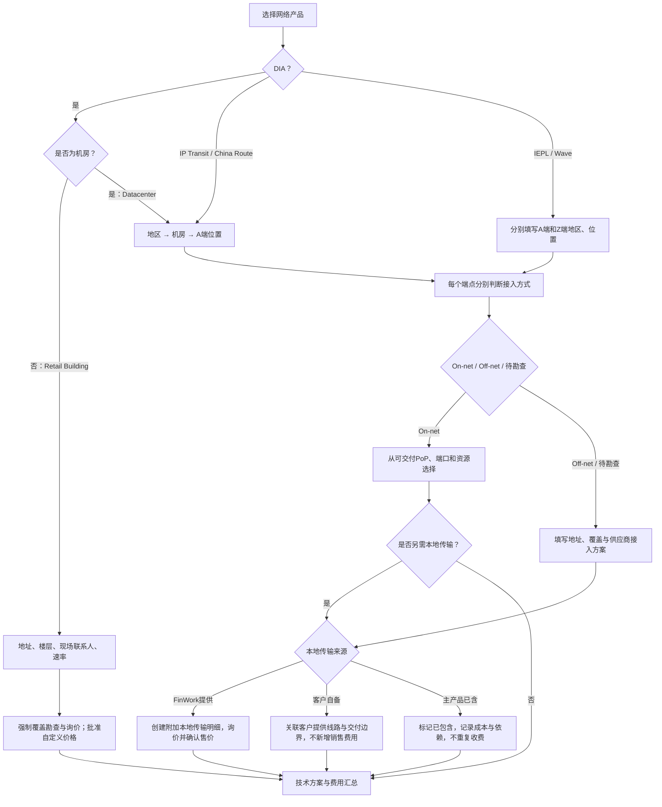
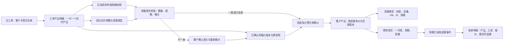
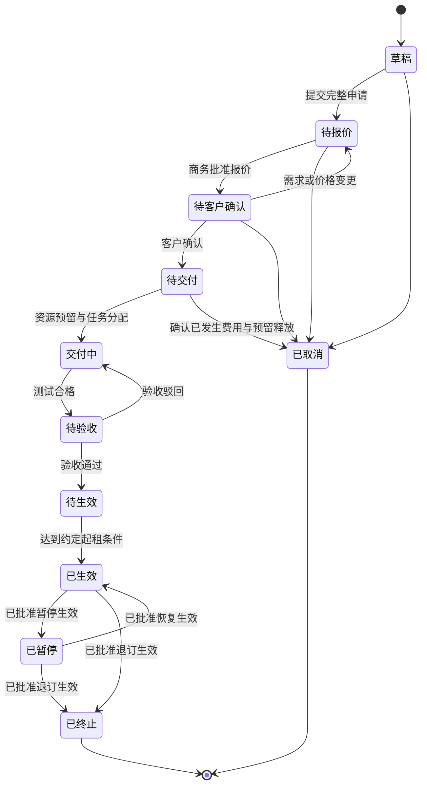
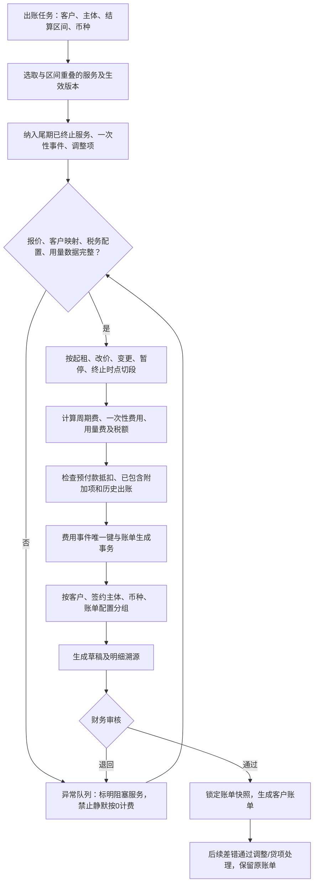

# FinWork：IDC 工单到客户产品与账单流程设计

版本：设计稿 v1，2026-09-21。本文是拟实施方案，不表示现有系统已经实现。产品目录以本次提供的清单为准；计费口径是建议默认值，最终取已确认的客户合同和报价。

## 1. 核心结构

**工单入口 → 结构化产品明细 → 报价确认 → 资源交付 → 验收与计费生效 → 客户产品 → 计费项目 → 客户账单草稿 → 财务审核。**

三个维度分别保存：

| 维度 | 回答的问题 | 示例 |
| --- | --- | --- |
| 工单类型 | 为什么处理 | 服务请求 REQ、故障 INC、维护 MTN |
| 业务动作 | 对服务做什么 | 询价、新开通、变更、续约、暂停、恢复、退订、一次性服务 |
| 产品分类 | 处理哪个产品 | 网络传输 → DIA → Datacenter |

地区、机房、A/Z 端、On-net/Off-net、带宽及合同期限使用参数，不复制进分类树。示例：`REQ / 新开通 / 网络传输-DIA-Datacenter / 香港 / A端Off-net / 100Mbps`。

一张主工单对应一个客户、一个签约主体；可以有多个产品明细。每个产品明细拥有独立报价、交付、验收、生效和取消状态，支持部分交付。跨客户或跨签约主体须拆单，必要时用项目关联。

## 2. 端到端总流程图

交付完成、工单完成、计费开始是三个不同时间。合同约定的预付费用可在验收前出账，但必须经过报价确认及财务批准，并标记为预付款；取消后通过退款/贷项处理，不能伪造已交付状态。

## 3. 多级产品分类

建议目录最多三层，稳定编码用于关联，显示名称允许调整。第二层通常是产品；仅具有明显不同参数或商务流程的产品设置第三层。

| 一级分类 | 产品编码 | 二级产品 | 三级 / 变体设计 |
| --- | --- | --- | --- |
| 机房资源 | `DC.RACK` | 整柜整租 | 柜型、电力为参数 |
| 机房资源 | `DC.COLO` | 散柜机位 | U 数、设备数量为参数 |
| 机房资源 | `DC.XC` | Cross Connect | 介质、接头、端点为参数 |
| 计算资源 | `COMPUTE.BMS` | 物理服务器 | 标准设备 / 四节点子节点为规格 |
| 计算资源 | `COMPUTE.VM` | 云主机 | CPU、内存、磁盘为规格 |
| 互联网资源 | `IP.V4` | IPv4 | 新分配 / 客户自带为资源来源 |
| 互联网资源 | `IP.V6` | IPv6 | 新分配 / 客户自带为资源来源 |
| 互联网资源 | `IP.ASN` | ASN | 申请代办 / 托管管理 / 变更协助为服务模式 |
| 上云互联 | `CLOUD.IX` | IX Peering | 直连接入 / 远程接入为接入模式 |
| 上云互联 | `CLOUD.CONNECT` | Cloud Connect | 云厂商、目标区域为参数 |
| 网络传输 | `NET.TRANSIT` | IP Transit | 地区、A端接入方式为参数 |
| 网络传输 | `NET.DIA.DC` | DIA | Datacenter；与楼宇接入互斥 |
| 网络传输 | `NET.DIA.RETAIL` | DIA | Retail Building；强制询价 |
| 网络传输 | `NET.CHINA` | China Route 回国带宽 | 地区、目标网络、A端接入方式为参数 |
| 网络传输 | `NET.IEPL` | IEPL | A/Z端、保护、突发为参数 |
| 网络传输 | `NET.WAVE` | Wave | A/Z端、波道容量、保护为参数 |
| 增值服务 | `VAS.RH` | Remote Hands | 按次 / 按时 / 已购包内额度为计价模式 |

IX Peering 暂按你的清单归入“上云互联”；业务报表如需精确命名，可将一级显示名改为“互联服务”，产品编码不变。ASN 默认建模为申请和管理服务，不预设为可自由销售的号码库存。

“附加本地传输”设计成可复用的附加服务编码 `ADDON.LOCAL_LOOP`，可挂在 IP Transit、DIA、China Route、IEPL 或其他需要接入段的主产品下。Cross Connect、IP、Remote Hands 同样可独立购买或作为附加产品。

## 4. 工单类型与业务动作

| 类型 | 业务动作 | 选已有客户产品 | 客户产品变化 | 收费控制 |
| --- | --- | --- | --- | --- |
| REQ | 询价 | 可选 | 不创建正式产品 | 不启动周期收费 |
| REQ | 新开通 | 否 | 创建客户产品草稿，验收后激活 | 产生批准的 NRC / 周期费 / 用量规则 |
| REQ | 变更 / 升降配 / 迁移 | 必须 | 保留产品ID，新增生效版本 | 按变更时点分段，不覆盖历史价格 |
| REQ | 续约 | 必须 | 新增合同/价格版本 | 从续约生效日执行 |
| REQ | 暂停 / 恢复 | 必须 | 改服务状态，保留资源关系 | 是否停费、保号费、恢复费来自条款 |
| REQ | 退订 | 必须 | 记录终止时间，释放允许释放的资源 | 结清至终止时点，单独审批违约或拆除费 |
| REQ | 一次性服务 | 可选 | 创建可追溯的服务记录 | 一次性收费，不创建无限续费订阅 |
| INC | 故障 | 原则上必须，无法定位可先受理 | 更新事件与影响关系 | 默认不收费；额外收费需关联REQ并确认 |
| MTN | 维护 / 割接 | 必须，可多产品 | 维护记录与窗口 | 默认不收费；规格/价格变化由关联REQ承接 |

原 `Ticket.type` 的 0/1/2 和工单编号规则保留。新增独立 `request_action`，不要通过增加大量 `type` 数值承载产品种类。

## 5. 创建工单的动态表单

推荐创建向导：**客户与动作 → 产品明细 → 技术参数 → 费用与报价 → 确认提交**。

每个产品明细卡片显示分类路径、主产品/附加项、配置摘要、资源可用性、报价状态、NRC、周期费、用量费摘要。非商务角色可填写技术资料，但不直接修改已批准售价。

### 5.1 公共字段

| 分组 | 字段 | 规则 |
| --- | --- | --- |
| 客户 | CRM客户ID、签约主体ID、客户联系人、账单联系人 | `Ticket.user_id` 是系统用户，不能代替客户ID；客户与主体须授权校验 |
| 工单 | 类型、动作、优先级、期望交付日、负责人、描述 | 期望日期不自动成为计费日期 |
| 产品 | 分类编码、产品ID、模板版本、数量、单位 | 叶子产品决定动态参数；数量必须大于0 |
| 商务 | 币种、合同期限、报价版本、付款方式、账期 | 币种和签约主体缺失时阻止出账 |
| 费用 | NRC、周期费、周期、用量规则、折扣、税务配置 | 区分未报价、免费、已包含、单独计费；空价格不等于0 |
| 生效 | 交付时间、验收时间、约定起租日、实际计费起止 | 新建工单只要求期望日期，生效字段在交付阶段补全 |
| 溯源 | 合同/订单/报价关联、附件、原工单、已有产品ID | 变更与退订必须指定目标产品 |

### 5.2 每种产品的参数与交付回填

以下字段为建议模板。表内“申请参数”在提交对应产品的开通申请时必填，注明可选/条件的除外；资源序列号、线路号等在交付阶段必填，询价阶段允许未知。

| 产品 | 申请参数 | 条件参数 | 验收前实际交付信息 | 推荐费用组成 |
| --- | --- | --- | --- | --- |
| 整柜整租 | 地区、机房、柜数、每柜U数、额定电力kW、合同期 | A/B路电、计量电费、超额电力、带宽/IP、安全围笼（可选） | 实际柜号、位置、电路/电表、交付电力与起租日期 | 柜租周期费；安装NRC；电力包内或独立用量项 |
| 散柜机位 | 地区、机房、设备台数、每台高度U、额定电力 | 双路电、设备尺寸/重量、管理服务、带宽/IP | 柜号、起始U位、高度、设备/资产ID、用电配置 | U位或设备周期费；安装NRC；电力附加项 |
| Cross Connect | 地区、机房、A/Z端主体与位置、介质、芯数/对数、接头 | LOA、机房工单、跨楼/园区说明、冗余、是否已含在其他产品中 | 两端配线架/面板/端口、XC编号、线路测试、供应商订单 | 安装NRC、维护周期费；已包含时不重复计费 |
| 物理服务器 | 地区、机房、型号/配置组、CPU、内存、磁盘、带宽 | 操作系统、RAID、IP数、备份、管理服务、四节点子节点 | 设备ID、节点名、SN、柜/U位、实际配置、IP | 台/节点周期费；安装NRC；带宽/IP附加项 |
| 云主机 | 地区、可用区/资源池、vCPU、内存GiB、磁盘GiB、系统 | IP/DHCP、网络/VLAN、备份、流量限额、到期时间 | 云平台、remote+vmid、实际规格、IP、开通时间 | 实例周期费或批准的按量模式；存储/IP附加项 |
| IPv4 | 资源来源、地区、地址数量或CIDR前缀长度、用途、路由方式 | 客户自带前缀、目标ASN、宣告授权、rDNS、地理信息要求 | 实际地址段、分配ID、宣告网络、绑定产品 | 按地址/地址段周期费；配置/宣告NRC或已包含 |
| IPv6 | 资源来源、地区、前缀长度、用途、路由方式 | 目标ASN、宣告授权、rDNS、下级分配要求 | 实际前缀、分配ID、宣告记录 | 按前缀周期费或已包含；配置NRC |
| ASN | 服务模式、申请主体、适用注册管理机构、用途、联系人 | 已有ASN、申请材料、上游与路由策略、管理服务期 | ASN号、申请/变更凭证、管理范围 | 代办NRC；持续管理周期费仅在明确购买时启用 |
| IX Peering | 地区、IX名称、直连/远程、端口速率、承诺带宽、客户ASN | Route Server/双边对等、VLAN、IPv4/IPv6、前缀限制、Cross Connect | 端口/接入线路ID、VLAN、对等IP、会话与连通测试 | 端口周期费；接入传输/XC按包含关系计价 |
| Cloud Connect | 云厂商、目标云区域、连接类型、带宽、客户接入端 | 云连接标识、冗余、VLAN、BGP ASN/对等地址、接入本地传输 | 云线路/虚拟连接ID、端口、实际带宽、连通测试 | 端口/连接周期费、NRC、约定用量费；标明云侧费用承担方 |
| IP Transit | 地区、A端位置、On-net/Off-net、端口速率、承诺带宽、计费模式 | BGP/静态、ASN、前缀、IPv6、突发上限、附加本地传输 | 实际端口/线路、客户前缀、对等信息、采样对象 | NRC、带宽周期费、批准的超量/95计费、本地传输 |
| DIA–Datacenter | 地区、机房、A端位置、On-net/Off-net、上下行速率、IP需求 | 路由方式、CPE、附加本地传输、SLA | A端线路、端口、IP/网关、测试与交付记录 | 带宽周期费、NRC、设备/本地传输附加项 |
| DIA–Retail Building | 地区、完整楼宇地址、楼层/房间、现场联系人、上下行速率 | 勘查、物业入场、施工、CPE、路由方式 | 覆盖核实、供应商线路ID、楼宇交接点、IP、验收资料 | **强制询价/自定义批准售价**；接入NRC、周期费、施工附加项 |
| China Route 回国带宽 | 地区、A端位置、On-net/Off-net、回国目标网络/地区、承诺带宽 | 路由质量档位、突发、双栈、附加本地传输、性能目标 | 实际线路/端口、路由交付范围、约定测试结果 | 带宽周期费、NRC、批准用量费与本地传输 |
| IEPL | A/Z端地区及地点、两端接入方式、承诺带宽、是否突发、接口、保护要求 | 突发上限/计费规则、VLAN/MTU、两端本地传输、性能目标 | 端到端线路ID、A/Z交付端口、实际配置、测试报告 | 主线路周期费、NRC、A/Z本地传输、批准突发费用 |
| Wave | A/Z端地区及地点、波道容量、客户端接口、保护方式 | 波长/光接口参数、两端接入段、路径分离、性能目标 | 波道/电路ID、两端端口、实际光接口、测试报告 | 波道周期费、NRC、接入段；默认不按IP流量收费 |
| Remote Hands | 地区、机房、关联设备/服务、任务类型、操作步骤、窗口 | 预计工时、最低计费时长、进位单位、夜间/节假日、材料、预算上限 | 操作起止、实际工时、材料、完成证据、客户确认 | 按次或确认工时；已有套餐先扣额度，超额另计 |

登录密码、BGP认证密钥等通过已有安全凭据机制交付，不写入客户产品摘要、账单或普通工单附件。

### 5.3 接入方式及附加本地传输

On-net 指相对所选运营商/网络的可交付范围，不仅由城市或机房名称推断。Off-net 需要确定接入方案，但不意味着必定由我方单独收费。On-net 也不能直接等同于“Cross Connect 免费”。

### 5.4 关键显隐规则

| 条件 | 动态行为 | 提交/验收校验 |
| --- | --- | --- |
| 产品为DIA | 显示“是否为机房” | 是→Datacenter；否→Retail Building，与第三层分类保持唯一映射 |
| A或Z端Off-net | 显示地址、供应商、覆盖状态、本地传输来源 | 交付前必须确定可交付方案及费用承担方 |
| 附加本地传输=我方提供 | 添加子明细：端别、起终点、速率、供应商、NRC/周期费 | 每个子明细单独计价；可选打包但保留组成 |
| IEPL突发=是 | 显示突发上限、采样/结算方式、超量单价/封顶 | 上限≥承诺带宽且不超过交付端口；缺计价规则不能确认报价 |
| IEPL突发=否 | 隐藏突发收费字段并清除未确认值 | 只使用固定带宽价格；不得残留超量费用 |
| 资源来源=客户自带 | 显示资源标识和授权材料 | 不生成IP资源租赁费，相关管理费须明确确认 |
| 业务动作=变更 | 显示旧配置、目标配置、差异、计划生效日 | 禁止直接修改已生效历史版本 |
| Remote Hands按时 | 显示预计时长、最小收费时长、进位规则与预算 | 结算用验收工时；超预算追加确认 |
| 费用状态=已包含 | 显示包含于哪个主产品/套餐 | 不允许同时生成独立销售费用 |
| 切换产品/场景 | 保留公共字段，提示清除不兼容专有参数 | 已报价则报价失效，重新计算；已验收则通过变更工单处理 |

模板规则建议保存字段类型、单位、选项数据源、`required_when`、`visible_when`、`read_only_when`、校验器、适用动作、角色权限以及客户产品映射路径。字段显隐与校验由前后端共同执行，不能仅依赖前端隐藏。

## 6. 从工单提取客户产品

“提取”以结构化明细映射为准：选产品后填写的参数、交付回填、已确认报价直接生成客户产品。自由文本、历史工单可辅助解析为候选值，但未经人确认不得激活、覆盖产品或开始收费。

| 来源 | 客户产品/计费目标 | 处理方式 |
| --- | --- | --- |
| 工单客户ID、签约主体 | `CustomerService.customer_id / signing_entity_id` | 固定引用，不通过名称匹配 |
| 分类编码、产品ID、模板版本 | `product_id / category_code / schema_version` | 保存版本快照，目录调整不影响历史 |
| 已验收技术参数 | `spec_snapshot / endpoints_snapshot` | 交付值与申请值不一致时必须确认差异 |
| 机柜/设备/VM/IP/线路 | `ServiceResourceBinding` | 资源允许多对多，受容量与独占约束 |
| 已批准报价项 | `ServiceCharge` | 每种收费组件一条，不将多个费用塞入备注 |
| 计费开始/结束和周期 | `BillingSubscription`或一次性费用事件 | 来源于已确认生效规则，不取工单完成时间猜测 |
| 工单及明细ID、验收版本 | `source_ticket_id / source_line_id / acceptance_version` | 保留全链路溯源和幂等键 |
| 主产品与附加服务关系 | `parent_service_id / dependency` | 主产品不能在必需接入段未就绪时交付 |

建议客户产品记录“购买了什么”，价格记录“按什么价格收费”，资源记录“实际用的什么”。单一价格记录不能替代客户产品：同一产品可同时有安装费、月费、IP费和用量费，也会经历多次改价。

## 7. 状态与生效边界

上图是产品明细/服务生命周期，不替换现有四种工单状态。现有工单仍显示未开始、进行中、已完成、已关闭；增加阶段摘要展示报价、交付、验收等进度。询价拒绝/取消不产生正式客户产品；交付中的取消须评估供应商已发生费用。已完成工单重开不重复开产品；已生效产品升级走新变更工单并引用原服务ID。

“已终止”服务仍参与终止所在期间的尾款结算，不能因状态不再活跃而被账单筛选直接跳过。工单技术验收后可结束，未来周期账单仍从服务的生效版本出账。

## 8. 客户账单生成

### 8.1 费用模型

| 组件 | 示例 | 触发与边界 |
| --- | --- | --- |
| NRC：一次性费用 | 安装、开通、施工、按次Remote Hands | 依据批准条款触发；一次性事件只收一次 |
| 周期费（MRC为月费） | 柜租、服务器、带宽、IP、线路 | 按月/季度/年等合同周期执行；首尾期按所选折算规则 |
| 用量费 | 超额电力、约定流量、突发带宽、工时 | 固定计量来源与结算窗口，缺数据不自动当作0 |
| 调整项 | 折扣、补差、服务抵扣、尾款 | 指定原服务/账期/原因和审批记录 |
| 预付款 | 合同约定预付安装或周期费 | 独立记录与抵扣，避免验收后再次收费 |

价格优先级建议：**当前已批准的工单报价快照 → 有效客户协议价 → 匹配规格的标准价 → 人工询价**。匹配必须同时符合主体、产品、地区/端点、规格、单位、周期、币种及有效期；不得跨币种直接取最低价。手动折扣和低于最低售价等例外进入明确审批。

### 8.2 计算规则

- 月费折算示例采用“自然月实际天数”：`月单价 × 数量 × 生效天数 / 当月天数`。合约约定整月、30天或不折算时选相应规则，不混用。
- 系统内部建议使用半开区间 `[开始时刻, 结束时刻)`；日粒度账单展示截止日为结束日前一天。统一合同计费时区，避免月中变更重复计同一天。
- 每次规格/价格变化建立新版本，旧版本结束于新版本开始时刻；月中变更分别计算各段。生效在过去且原账单已锁定时产生补差，不重写原账单。
- 95计费仅在报价明确启用时适用；采样周期、入/出方向合并口径、缺样阈值、计量单位、承诺值、最低收费和舍入规则必须固定。不能仅凭“是否突发”推导费用。
- Remote Hands 按确认工时及合同进位单位计算；材料与加班费分别列项。先抵扣已购包内额度，剩余部分再计费。
- 单价、数量、折扣、税额采用 Decimal 计算，保留计算快照并按币种规则舍入。税率、含税/未税、汇率取已确认配置，不在工单中自动猜测。
- 幂等键区分费用类型：周期费用“服务ID+费用组件ID+计费子区间+价格版本”；一次性费用用“费用事件ID”；用量费用“服务ID+规则版本+采样结算区间”。数据库唯一约束加事务，任务重试不能重复出账。
- 主产品与附加项按“单独计费/已含/免费/客户自备”明确标记。供应商成本与客户销售价格分别维护，采购金额不能自动成为客户售价。
- 草稿重算通过替换同一草稿的计算版本完成，不新增重复费用；已开账单作废后要有可审计的费用释放/重开机制。

### 8.3 完整例子：DIA楼宇接入到首张账单

假设一张REQ新开通工单，客户A，签约主体Catixs，香港Retail Building，100Mbps。所有金额仅为流程示例，使用USD，暂不计税；合同明确按自然月实际天数折算。

1. 选择 `网络传输 → DIA → Retail Building`，表单要求完整地址、现场联系人、速率和IP需求。
2. 强制询价，确认Off-net接入。主DIA费用为 NRC 100 + MRC 300；本地传输为 NRC 50 + MRC 120，单独收费。供应商成本留在内部。
3. 客户确认报价版本Q1，生成主服务明细与本地传输子明细；创建依赖任务，接入段未就绪时不能验收主DIA。
4. 9月10日完成验收并约定起租；两个服务生效。工单回填线路ID、交接点、IP、测试证据，映射为客户产品。
5. 9月计费区间为 `[9月10日, 10月1日)`，共21天，9月共30天。DIA月费 `300×21/30=210`；本地传输月费 `120×21/30=84`；NRC为150。
6. 首张账单税前金额为 `210+84+150=444 USD`，明细分别列主DIA和本地传输，并能追溯工单行、验收、报价Q1。
7. 10月完整周期为420 USD，不再计入NRC。重复执行9月出账任务不产生第二张重复账单或第二笔NRC。

若本地传输被报价标为“已含在主DIA”，则不再生成独立销售费用；若本地传输提前交付但DIA未验收，子项是否独立起租必须取报价条款，不能默认提前收费。

## 9. 与现有 FinWork 的衔接

以下现状依据当前仓库，新增项均属于本设计建议。

| 模块 | 当前代码依据 | 实施建议 |
| --- | --- | --- |
| 工单 | `app/models/ticket.py`、`app/schemas/tickets.py`：类型、用户、描述、状态、时间、处理人 | 保留旧字段，新增CRM客户、主体、业务动作、阶段；新增多产品明细和验收信息 |
| 分类与产品 | `app/models/product_center.py`：`ProductCategory.parent/level`、`ProductItem` | 复用多级分类，按本目录配置稳定编码 |
| 产品规格 | `ProductSpecAttribute`、`ProductSpecConfig`、`ProductTemplate` | 扩展条件显隐、按动作必填、版本冻结、端点组件、费用组件映射；已有属性不重复建 |
| 客户价格 | `ProductPrice`含客户、规格组、币种、计费模式和设备/VM绑定 | 保留兼容，将已确认价格作为报价来源；增加服务ID/报价版本关联，不能把价格删除等同于服务退订 |
| 客户产品 | 当前价格记录存在部分服务/资源信息，缺独立完整服务生命周期 | 新增 `CustomerService`、`CustomerServiceVersion` 与 `ServiceResourceBinding` |
| 账单订阅 | `app/models/company.py`：`BillingSubscription`有周期单价、数量、起止日期、币种 | 增加服务、费用组件、主体与来源关联；保留现有路由及历史订阅 |
| 自动出账 | `app/api/v1/bills/bills.py`：`/generate`当前按月折算，按company+currency分组；NRC固定为0 | 扩展NRC事件、用量结算、生效分段、主体分组、事务幂等；保留dry_run预览 |
| 账单主体 | CRM客户用 `CrmCustomer`，现有订阅/账单使用 `Company` | 明确客户/账务主体映射并校验唯一性；不能直接把CRM客户ID写成company_id |
| 资源与计费 | 现有价格接口包含云资源/物理设备联动 | 交付调用沿用模块接口，增加服务事件与幂等控制，避免旧价格联动和新工单流程重复创建/释放资源 |

建议新增逻辑实体：`TicketLine`、`TicketLineQuoteVersion`、`DeliveryAcceptance`、`CustomerService`、`CustomerServiceVersion`、`ServiceResourceBinding`、`ServiceCharge`、`BillingEvent`。复用现有合同、报价、订阅及审计能力，字段详细设计阶段再确定拆表边界。

验收生效事务同时写服务版本、费用事件、来源幂等键；跨系统交付或账单通知使用可重试事件队列。资源调用失败保持明确待重试状态，不在数据库事务内长时间等待供应商网络操作。

权限分工：销售维护需求与报价，技术确认方案，采购维护询价成本，运维实施并回填，客户/授权商务确认验收，财务复核费用与账单。客户仅能看到自己的工单和产品；报价、采购成本、资源凭据分别授权。

## 10. 实施顺序与验收场景

### 第一期：完整闭环

先完成目录、工单产品明细、条件表单、报价确认、验收、客户产品和固定周期/NRC出账。16种产品全部可建结构化工单；DIA楼宇/Off-net、复杂线路使用人工询价，未支持的自动计量明确转人工审核。

### 第二期：变更与资源联动

支持月中改配/改价、续约、暂停/恢复、退订、部分交付、附加项依赖、设备/VM/IP分配，以及旧客户产品和价格迁移映射。

### 第三期：计量与运营自动化

接入突发带宽、流量、电力、Remote Hands工时与额度，增加数据完整性检查、异常队列、自动出账预览和审批提醒。只有经过批准的计价模型才开启自动结算。

关键验收用例：

1. 每种产品切换后只显示适用参数；隐藏字段不能绕过后端校验，跨产品旧参数不泄漏。
2. DIA楼宇必须询价；DIA机房On-net可匹配标准价；Off-net必须确认接入方案。
3. IEPL突发切换正确；A/Z端独立选择On-net/Off-net，允许仅一端有附加本地传输。
4. 一张工单多产品部分验收，仅符合生效条件的明细进入对应计费周期。
5. INC/MTN完成不生成客户产品或账单；询价确认也不会自动开通。
6. 重复验收、事件重试、并发出账不重复创建产品、租约、NRC和周期明细。
7. 月中开通/改价/终止无遗漏或重复天数；已终止服务仍收尾款，暂停按合同执行。
8. 附加项已含时不重复收费；取消释放独占资源，共享资源须检查其他有效引用。
9. 缺用量、未报价、客户映射不明、跨主体/跨币种混单进入阻塞清单。
10. 从账单每行可反查客户产品、工单产品行、原报价和验收记录；历史版本不可被新模板覆盖。

## 11. 行业名词参考与设计假设

Cross Connect 作为物理布线交付单独记录两端；云连接、IX接入分别保留自己的逻辑连接/端口信息，避免把不同交付层次合并为一个字段。参考 [Equinix Cross Connect文档](https://docs.equinix.com/cross-connect/)、[Equinix Fabric文档](https://docs.equinix.com/fabric/)、[Equinix Internet Exchange文档](https://docs.equinix.com/internet-exchange/)。这些来源用于术语核对，不构成FinWork的价格、包含项或合同规则。

本设计暂按“整柜整租=整柜托管租用；China Route=有明确回国目标网络的带宽产品；上云互联包含IX与Cloud Connect”处理。实际产品定义不同可调整模板。起租标准、暂停收费、折算规则、是否允许拆分出账、审批金额阈值、95计费口径和税务配置应在实施时配置确认；设计中没有把待确认政策写死为行业通则。
